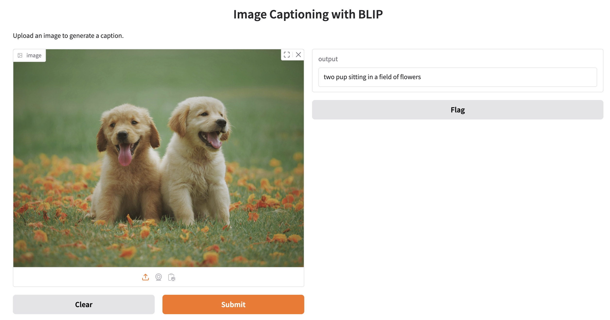

# Building Image Captioning and Image Classification app with Gen AI

## Background
I've completed the course [Building Generative AI-Powered Applications with Python](https://www.coursera.org/learn/building-gen-ai-powered-applications) to build a computer vision application. As part of the learning process, I’m exploring additional resources to deepen my understanding of the libraries and models being used. This repository serves as a collection of what I’ve learned so far, shared from the perspective of someone new to this GenAI space.

## Overview
The application uses:
- [PyTorch](https://pytorch.org/docs/2.6/): a deep learning library
- [Bootstrapping Language-Image Pre-training (BLIP)](https://huggingface.co/docs/transformers/en/model_doc/blip): a model to perform things like image captioning, image-text retrieval, etc.
- [Gradio](https://www.gradio.app/): a Python library that allows you to build web app very quickly

## Stage 1 - Python script for image captioning
[1-image-caption.py](1-image-caption.py) is a Python script that takes an image as the input and uses the [`Salesforce/blip-image-captioning-base` model](https://huggingface.co/Salesforce/blip-image-captioning-base) from [HuggingFace](https://huggingface.co/) to generate the image caption of the provided image.

To run: `python3 1-image-caption.py`.
The script is using an [astronaut photo](./assets/astronaut.jpg) as an input. The output will be something like:
```
Generated Caption: a young man in an orange astronaut suit and helmet
```


## Stage 2 - A simple web app using Gradio
This is just mainly to learn how to use [Gradio](https://www.gradio.app/guides/quickstart#building-your-first-demo) to create a simple web app.

After running `python3 2-simple-web-app.py` command, the web app can be reached at http://127.0.0.1:7860. From the web browser, you will see:


## Stage 3 - Create a web app for image captioning
Combining what we have on image captioning (in Stage 1) and on creating a web application (in Stage 2), we have [3-image-caption-webapp.py](./3-image-caption-webapp.py).

After running this Python script, you can specify the image in the app and ask it to generate the description of the image.

You'll see the image description on the right after selecting an image:


## Stage 4 - Image classification
In the example that I followed, it uses the [ResNet model](https://pytorch.org/vision/stable/models/resnet.html) for image classification with the [sample code](https://pytorch.org/vision/stable/models.html#classification).

Specify an image and you'll see the classification on the right, like below:

_The classification is not so accurate, but you get the idea._


_Lesson learned_: The versions of `torch` and `torchvision` have to be compatible. At the time of writing this readme, I'm using:
- `torch`: 2.6.0
- `torchvision`: 0.21.0

To find out which versions of the libraries you are using, I've created [test.py](./test.py).

